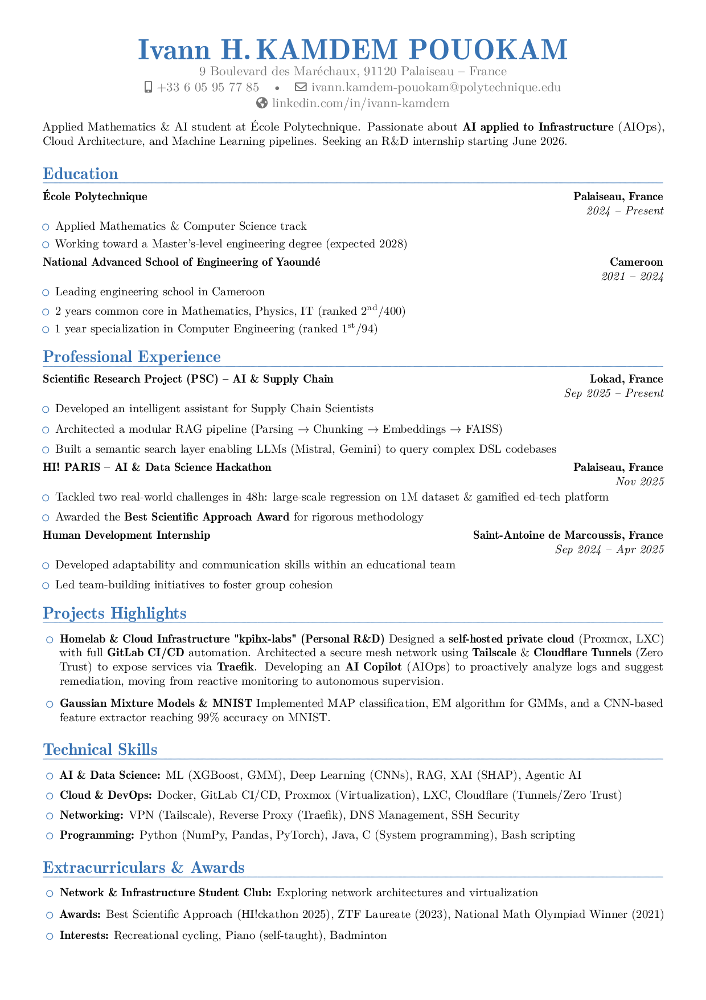

# CV - KAMDEM Ivann

[](https://github.com/KpihX/cv-atf/actions/workflows/build-pdf.yml)
[](https://gitlab.com/kpihx/cv-atf/-/pipelines)

Academic and professional résumé — **moderncv** banking style, blue theme, built with pdflatex.

---

## 📄 Preview

> _Preview is auto-generated by CI on each push to `master`._



---

## 🏗️ Stack

| Component | Choice |
|-----------|--------|
| Document class | `moderncv` (banking style) |
| Color theme | blue |
| Font | TeX Gyre Pagella (`tgpagella`) |
| Compiler | **pdflatex** |

> ℹ️ **Engine note:** moderncv banking uses `tgpagella.sty` (pdflatex font package).
> Use `pdflatex` for correct bold, color, and TeX Gyre Pagella rendering.
> XeLaTeX causes font conflicts with banking's pdflatex font loader.

---

## 🚀 Build locally

### Prerequisites

```bash
# Ubuntu / Debian — full texlive (recommended)
sudo apt-get install texlive-full

# Minimal
sudo apt-get install texlive-latex-extra texlive-fonts-extra
```

### Makefile (recommended)

```bash
make           # compile — double pass, intermediates in build/, PDF copied to root
make preview   # generate preview.png from the compiled PDF (requires imagemagick)
make clean     # remove build/ and root PDF
```

### Manual (pdflatex)

```bash
mkdir -p build
pdflatex -interaction=nonstopmode -output-directory=build CV_KAMDEM_Ivann.tex
pdflatex -interaction=nonstopmode -output-directory=build CV_KAMDEM_Ivann.tex
cp build/CV_KAMDEM_Ivann.pdf .
```

Output: `CV_KAMDEM_Ivann.pdf` at the project root — ready to share directly.

> ⚠️ Always use **pdflatex** — moderncv banking loads `tgpagella.sty` (a pdflatex font package).
> XeLaTeX causes font conflicts leading to bold and color rendering failures.

---

## 🤖 CI/CD

Both pipelines trigger on every push to `master`:

| Platform | Config | Artifacts |
|----------|--------|-----------|
| **GitHub Actions** | `.github/workflows/build-pdf.yml` | `CV_KAMDEM_Ivann.pdf` (90 days) · `preview.png` committed to repo |
| **GitLab CI** | `.gitlab-ci.yml` | `CV_KAMDEM_Ivann.pdf` + `preview.png` (1 year) |

On **tagged releases** (`git tag vX.Y && git push github --tags`), a GitHub Release is created with the PDF attached.

---

## 📂 Structure

```
cv-atf/
├── CV_KAMDEM_Ivann.tex          # LaTeX source (single file)
├── preview.png                  # auto-generated by CI, committed to repo
├── Makefile                     # make / make preview / make clean
├── README.md
├── CHANGELOG.md
├── TODO.md
├── .gitignore
├── .gitlab-ci.yml               # GitLab CI pipeline
├── .github/
│   └── workflows/
│       └── build-pdf.yml        # GitHub Actions pipeline
└── build/                       # LaTeX intermediates — git-ignored
    ├── CV_KAMDEM_Ivann.aux
    ├── CV_KAMDEM_Ivann.log
    ├── CV_KAMDEM_Ivann.out
    └── CV_KAMDEM_Ivann.pdf      # copied to root by make (root PDF also git-ignored)
```

---

## 🔗 Repos

- **GitHub:** [KpihX/cv-atf](https://github.com/KpihX/cv-atf)
- **GitLab:** [kpihx/cv-atf](https://gitlab.com/kpihx/cv-atf)
